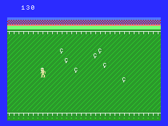
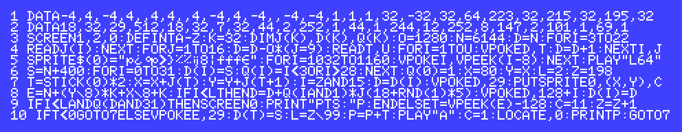

Chickens (BASIC 10-liner)
=========================

**Chickens** is a game written for the MSX platform in just 10 lines of BASIC code.

  * `Title...` : CHICKENS
  * `Platform` : MSX
  * `Author..` : Martin Rizzo
  * `Language` : MSX BASIC 1.0
  * `Category` : PUR-80


Files
-----

    CHICKENS.BAS   BASIC source code in ASCII.
    CHICKENS.GIF   Game screenshot.
    CHICKENS.DSK   720Kb disk image for use with the emulator.
    CHICKENS.ZIP   ZIP containing a WAV audio file for use on real MSX.
    README.HTM     Full documentation in HTML.
    README.MD      Full documentation in Markdown format.
    README.TXT     Text file with a brief description of the game.


Gameplay
--------

Use the arrow keys to move the farmer and capture all the crazy
chickens before they escape from the pen.  
You just have to touch the chickens to capture them.   
The game is over when a chicken reached the limits of the screen.




How to Run the Game
---------------------

### Loading the game in blueMSX emulator

  1. Download blueMSX FULL v2.8.2 (or above) from some of these links:
      * [blueMSX home page    ]( http://www.bluemsx.com/ )
      * [blueMSX download page]( http://bluemsx.msxblue.com/download.html )
  2. Install the emulator following the setup wizard.
  3. Start blueMSX
  4. Select `"File > Disk Drive A > Insert"`
  5. Select the provided .DSK file (the disk image)
  6. Select `"Emulation > Run"` and enjoy the game!

### Loading the game in real hardware

  1. Extract the provided ZIP file containing the WAV audio file
  2. Copy the WAV file to some audio player (smartphone, table, notebook, PC, ...)
  3. Connect the EAR cable from the audio player to your MSX
  4. Type `CLOAD` on your MSX
  5. Start the playback of the WAV file
  6. When the load is complete, type `RUN` and enjoy the game!


Source Code with Explanation
----------------------------



### Lines 1,2: the game data

```
'  first segment is player movement data to be assigned into J(3-17),
'  data is grouped in pairs of values where:
'     - the first value is player movement on x-axis (in pixels)
'     - the second value is player movement on y-axis (in pixels)
'  note: the values in J(0-3) will be zero
DATA -4,  4,-4,  4,0,  4,4,  0,4,  -4,4,  -4,0,  -4,-4
```
---
```
'  second segment is chickens movement data to be assigned into J(18-22)
'  values are movements relative to video memory addresses:
'       1 : move 1 character right
'      32 : move 1 character down
'     -32 : move 1 character up
'  one of these 5 values will be chosen randomly each time a chicken move
DATA 1, 1, 1, 32, -32
```
---
```  
'  third segment contains the instructions to draw the playfield
'  data is grouped in pairs of values where:
'       - the first value is the character to use
'       - the second value is the number of times to repeat the character
DATA 32,64,  223,32,  215,32,  195,32,  18,32,  29,512,  18,32,  7,32
```    
---
```
'  last segment contains the colors for playfield characters
'  data is grouped in pairs of values where:
'        - the first value is a color-code
'        - the second value is the number of times to repeat the color-code
DATA 44,2,  252,1,  44,1,  244,12,  252,8,  147,2,  101,1,  69,1
```
---    

### Lines 3,4: constants, arrays and drawing playfield

```
'  sets the 32x24 text mode with sprite size of 16x16
SCREEN 1,2,0
'  defines all variables as integer
DEFINT A-Z
'  uses some variables as constants
'     K : 32    (a frequently used value)
'     O : 1280  (value used when drawing playfield)
'     N : 6144  (the name-table address in video memory)
K=32
O=1280
N=6144
'  defines arrays sizes
DIM J(K),D(K),Q(K)
```
---
```
'  reads player movement data and chicken movement
'  data and store them into J() array
FOR I=3 TO 22 : READ J(I) : NEXT
```
---
```    
'  draws playfield writing values to video memory
'      D    : video address to write
'      T    : value
'      U    : number of times to repeat value
'   -O(J=9) : when J==9 -> 1280 otherwise zero
D=N
FOR J=1 TO 16
    D = D -O*(J=9)
    READ T,U
    FOR I=1 TO U
        VPOKE D,T
        D = D+1
    NEXT I
NEXT J
```
---

### Line 5: graphic and sound initialization
```
'  sets the farmer graphic in sprite 0
'  note: only farmer is a sprite, chickens are characters of text
SPRITE$(0)="..."
'  sets music notes to the shortest possible duration
PLAY "L64"
```
---
```
'  copies graphic of text character number 128 (the chicken char)
'  to the next 16 characters, all of them will be visually identical
'  but it will be easy to associate character number with chicken index
FOR I=1032 TO 1160
    VPOKE I, VPEEK(I-8)
NEXT
```

### Line 6: game loop initialization
```
'  sets player initial position to 80,80 
X=80:Y=80
'  sets difficulty level to 2 (Z is always equal to L*99)
L=2:Z=198
'  sets chickens initial position to:
'   [col=16,row=12] : (16)+(12)*32 + N = 400 + N
'   N is the video address of the first (top-left) character in the screen
S=N+400
FOR I=0 TO 31
    D(I)=S
    Q(I)= (I<3) OR (I>28)
NEXT
Q(0)=1
```

### Lines 7,8: movement (game loop)
```
'  moves the player
'     J(STICK()*2+0) : delta movement on X-axis
'     J(STICK()*2+1) : delta movement on Y-axis
'     X,Y : player screen coordinates
'      C  : player color, 11=yellow, 1=black
T=STICK(0)*2
X=X+J(T)
Y=Y+J(T+1)
PUT SPRITE 0,(X,Y),C
```
---
```
'  moves the chicken
'      L   : current difficulty level (increments each 99 cycles)
'      Z   : game cycle (increments each cycle)
'      I   : chicken index (valid range: 0-15)
'      D   : chicken video position/address
'     29   : background char (used to erase the chicken char)
'  (128+I) : chicken char
'  note: only chicken with index (I) below player level (L)
'  will actually be moved, but as level increases as time 
'  passes, more and more chickens appear at the screen.
I = Z AND 15
D = D(I)
VPOKE D,29
IF I<L THEN
    D = D + Q(IAND1) * J(18+RND(1)*5)
    VPOKE D, (128+I)
    D(I)=D
ENDIF
```
---

### Lines 8,9,10: game logic (game loop)
```
'  calculates the chicken video address that corresponds to the player coordinate
'    X,Y : player's coordinates in pixels
'     N  : video address of the first (top-left) character in the screen
'     E  : video address that corresponds to the player coordinates
E = N + (Y\8)*32 + (X\8) + 32
```
---
```
'  if chicken is out of the pen
'  then print player's points and end the program
IF I<L AND Q(D AND 31) THEN
    SCREEN 0
    PRINT "PTS:"P
    END
ENDIF
'  (at this point the chicken is inside the pen)
'  increment player game time
'  and set default player color to yellow
Z = Z+1
C = 11
```
---
```
'  check character under the player
'     E : video address that corresponds to the player coordinates
'     T : chicken index in that address (valid range: 0-15)
T = VPEEK(E)-128
IF T<0 GOTO <game-loop>
ELSE
    '  player is over a chicken!!
    '  -> remove chicken character
    '  -> move chicken to start point
    '  -> increase player points
    '  -> adjust player level relative to player game time
    VPOKE E,29
    D(T)=S
    P = P+T
    L = Z\99
    '  -> set player color to black
    '  -> play capture sound
    '  -> print player points
    C = 1
    PLAY "A"
    LOCATE 0,0 : PRINT P
    GOTO <game-loop>
ENDIF
```
---

More Code References
--------------------

### Variables & constants

```
     N   : name table address          <constant>
     K   :  32                         <constant>
     O   : 1280                        <constant>
    Q(0) :   1                         <constant>
    Q(1) :  -1                         <constant>
    Q(n) : chicken-is-outside flags    <constant>
J(00-17) : player movement table       <constant>
J(18-22) : chickens movement table     <constant>
     S   : chicken initial pos/address <constant>
     T   : temporary var
    I,J  : temporary vars (loops)
    X,Y  : player screen coordinate
     Z   : player game time
     L   : player level (=Z/99)
     P   : player points
    D(n) : chicken current pos/address
```


---

2020 - Martin Rizzo <martinrizzo@gmail.com>

