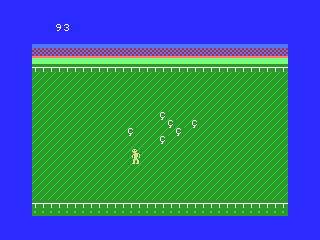

Chickens (BASIC 10-liner)
=========================

**Chickens** is a game made in just 10 lines of BASIC code for the MSX platform.

* Title    : CHICKENS
* Platform : MSX
* Author   : Martin Rizzo
* Language : MSX BASIC 1.0
* Category : PUR-80

Files
-----

```
CHICKENS.BAS : BASIC source code in ASCII.
CHICKENS.GIF : Game screenshot.
CHICKENS.DSK : 720Kb disk image for use with the emulator.
CHICKENS.WAV : Audio file for use on real MSX hardware.
README.TXT   : Text file with a brief description of the game.
README.MD    : Full documentation in Markdown format.
README.PDF   : Full documentation in PDF.
```


How to play
-----------

Use the arrow keys to move the farmer and capture all the
crazy chickens before they escape from the corral.   
You just have to touch the chickens to capture them.   
The game is over when a chicken can reach the limits of the screen.



How to start the game
---------------------

< description of how to load the game into the emulator >

< description of how to load the game on real hardware >

Also, you can play the game using the following online emulator:   
http://webmsx.org/?MACHINE=MSX1&DISK=http://???.zip


Code explanation
----------------

### Variables & constants reference

```
     N   = name table address          <constant>
     K   =  32                         <constant>
     O   = 1280                        <constant>
    Q(0) =   1                         <constant>
    Q(1) =  -1                         <constant>
    Q(n) = chicken-is-outside flags    <constant>
J(00-17) = player movement map         <constant>
J(18-22) = chickens movement map       <constant>
     S   = chicken initial pos/address <constant>
     T   = temporary var
    I,J  = loops
    X,Y  = player screen coordinate
     Z   = player game time
     L   = player level (=Z/99)
     P   = player points
    D(n) = chicken cur pos/address
```

### Game data (2 lines)

### Initialization (1 line)

### Drawing  playfield (1 line)

### Init sprite graphic and sound (1 line)

### Init game loop (1 line)

### Game loop (4 lines)


---

2020 - Martin Rizzo <martinrizzo@gmail.com>

