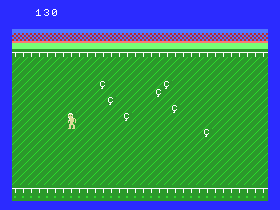

Chickens (BASIC 10-liner)
=========================

**Chickens** is a game written for the MSX platform in just 10 lines of BASIC code.

* `Title...` : CHICKENS
* `Platform` : MSX
* `Author..` : Martin Rizzo
* `Language` : MSX BASIC 1.0
* `Category` : PUR-80

Files
-----

```
CHICKENS.BAS   BASIC source code in ASCII.
CHICKENS.GIF   Game screenshot.
CHICKENS.DSK   720Kb disk image for use with the emulator.
CHICKENS.WAV   Audio file for use on real MSX hardware.
README.TXT     Text file with a brief description of the game.
README.MD      Full documentation in Markdown format.
README.PDF     Full documentation in PDF.
```


How to play
-----------

Use the arrow keys to move the farmer and capture all the
crazy chickens before they escape from the pen.   
You just have to touch the chickens to capture them.   
The game is over when a chicken can reach the limits of the screen.




How to start the game
---------------------

< description of how to load the game into the emulator >

< description of how to load the game on real hardware >

Also, you can play the game using the following online emulator:   
http://webmsx.org/?MACHINE=MSX1&DISK=http://???.zip


Code explanation
----------------

### Variables & constants

```
     N   = name table address          <constant>
     K   =  32                         <constant>
     O   = 1280                        <constant>
    Q(0) =   1                         <constant>
    Q(1) =  -1                         <constant>
    Q(n) = chicken-is-outside flags    <constant>
J(00-17) = player movement table       <constant>
J(18-22) = chickens movement table     <constant>
     S   = chicken initial pos/address <constant>
     T   = temporary var
    I,J  = temporary vars (loops)
    X,Y  = player screen coordinate
     Z   = player game time
     L   = player level (=Z/99)
     P   = player points
    D(n) = chicken current pos/address
```
### Code


### Lines 1,2: Game data

```
'  player movement table to be assigned into J(3-17),
'  note: the values in J(0-3) will be zero
'  pair of values where the first one is movement on X coordinate
DATA  -4,4,  -4,4,  0,4,  4,0,  4,-4,  4,-4,  0,-4,  -4
```
---
```
'  chickens movement table to be assigned into J(18-22)  
'  the velues means delta movements in video memory:
'   *   1 means 1 step right
'   *  32 means 1 step down
'   * -32 means 1 step up
'  these 5 values will be randomicamente choised in each chicken movement
DATA 1, 1, 1, 32, -32
```
---
```  
'  playfield background
'  pair of values where the first one is an ASCII character
'  and the second is the number of repetitions
DATA  32,64,  223,32,  215,32,  195,32,  18,32,  29,512,  18,32,  7,32
```    
---
```
'  playfield background color
'  pair of values where the first one is a color code to apply
'  and the second is the number of repetitions
DATA 44,2,  252,1,  44,1,  244,12,  252,8,  147,2,  101,1,  69,1
```
---    

### Lines 3,4: Initialization + drawing playfield

```
SCREEN 1,2,0
DEFINT A-Z
K=32
O=1280
N=6144
DIM J(K),D(K),Q(K)
```
---
```
FOR I=3 TO 22 : READ J(I) : NEXT
```
---
```    
'  drawing playfield
D=6144
FOR J=1 TO 16
    D=D-I*(J=9)
    READ T,U
    FOR I=1 TO U
        VPOKED,T
        D=D+1
    NEXT I
NEXT J
```
---

### Line 5 (initialization of graphic and sound)
```
SPRITE$(0)="..."
FOR I=1032 TO 1160
    VPOKE I, VPEEK(I-8)
NEXT
PLAY "L64"
```

### Line 6 (game loop initialization)
```
S=N+400
FOR I=0 TO 31
    D(I)=S
    Q(I)= (I<3) OR (I>28)
NEXT
Q(0)=1
X=80:Y=80
L=2
Z=198
```

### Lines 7,8,9,10 (game loop)
```
'  moves player
'    J(STICK()*2+0) = delta movement in X coordinate
'    J(STICK()*2+1) = delta movement in Y coordinate
'          C        = player color (11=yellow, 1=black)
T=STICK(0)*2 : X=X+J(T) : Y=Y+J(T+1)
PUT SPRITE 0,(X,Y),C
```
---
```
I=Z AND 15
```
---
```
'  moves the chicken
'     L   = current difficulty level
'     I   = chicken index
'     D   = chicken video position/address
'    29   = background char (used to erase the chicken char)
'   128+I = chicken char
D=D(I)
VPOKE D,29
IF I<L THEN
    D = D + Q(IAND1) * J(18+RND(1)*5)
    VPOKE D,128+I
    D(I)=D
ENDIF
```
---
```
'  calculates the chicken position/address that corresponds to the player coordinate
'   X,Y = player's coordinates in pixels
'   N   = video address of the first (top-left) character in the screen
'   E   = chicken video address
E = N + (Y\8)*32 + (X\8) + 32
```
---
```
IF I<L AND Q(D AND 31) THEN
    ' chicken is out of the pen,
    ' print points and end the program
    SCREEN 0
    PRINT "PTS:"P
    END
ELSE
    ' chicken is inside the pen
    ' verify character under the player
    Z = Z+1
    C = 11
    T = VPEEK(E)-128
    IF T<0 GOTO <game-loop>
    ELSE
        ' player is over a chicken
        '   E = chicken video address
        '   T = chicken index
        VPOKE E,29
        D(T)=S
        L=Z\99
        P=P+T
        PLAY "A"
        C = 1
        LOCATE 0,0 : PRINT P
        GOTO <game-loop>
    ENDIF
ENDIF
```


---

2020 - Martin Rizzo <martinrizzo@gmail.com>

