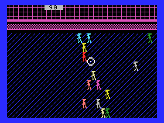

MSX-BASIC / 10 Liner Games
==========================

A couple of MSX games made in 10 lines of pure BASIC.

This project contains the games that i develop for the [10 Liner Basic Contest](https://mobile.twitter.com/basic10l) over the years. All the games run on the [MSX platform](https://en.wikipedia.org/wiki/MSX) using standard MSX-BASIC v1.0 and they can be loaded and played on any MSX emulator or real hardware.

The README file in each game directory gives instructions on how run the game. It also contains info about the gameplay and a description of the source code.

Code Details
------------

All the games here fit into one of contest 3 main categories:

  * **PUR-80:** 10 lines of code with a maximum of 80 characters per line
  * **PUR-120:** 10 lines of code with a maximum of 120 characters per line
  * **EXTREME-256:** 10 lines of code with a maximum of 256 characters per line

In adittion, the code follows the main rules of the contest:

 * no reloading of data or program parts
 * can not contain self-written machine code
 * use of POKE and VPOKE is allowed

The Games
---------

### CHICKENS

### ALIENS10

License
-------

This project has been released to public domain under CC0 1.0 license, meaning you can use it free of charge, without strings attached in commercial and non-commercial projects. This software is distributed without any warranty.

Although attribution is not required, crediting the author would be greatly appreciated, thank you.

For more detailed information, please refer to <http://creativecommons.org/publicdomain/zero/1.0/>.

Author
------
Martin Rizzo <<martinrizzo@gmail.com>>
